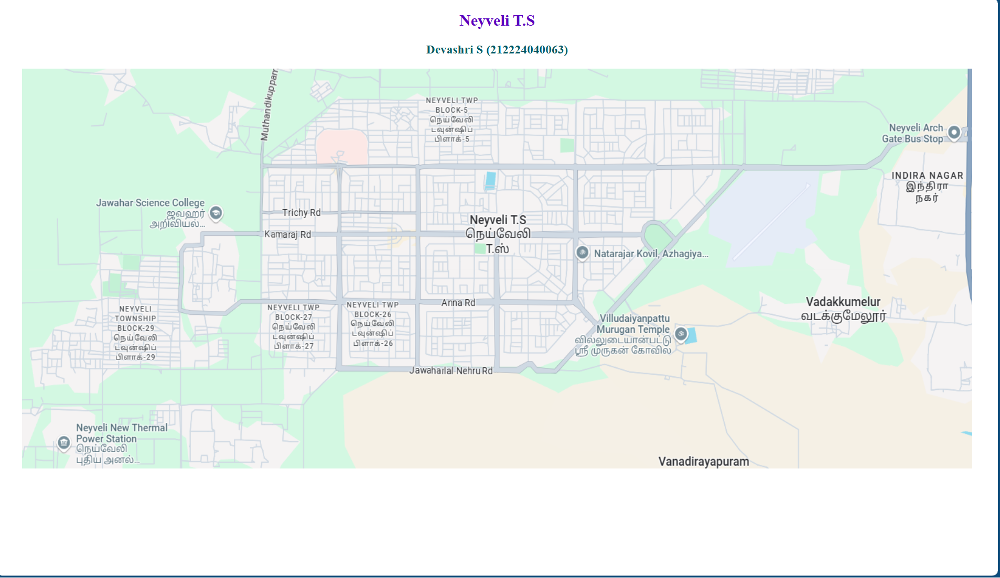
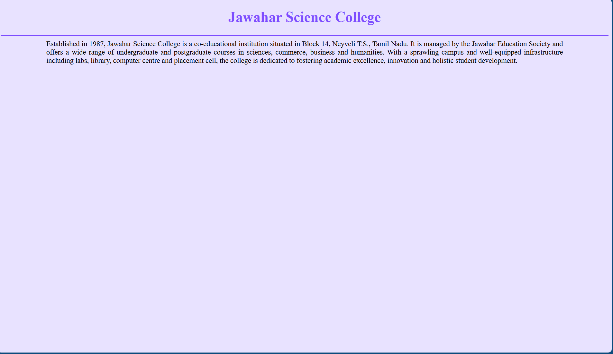
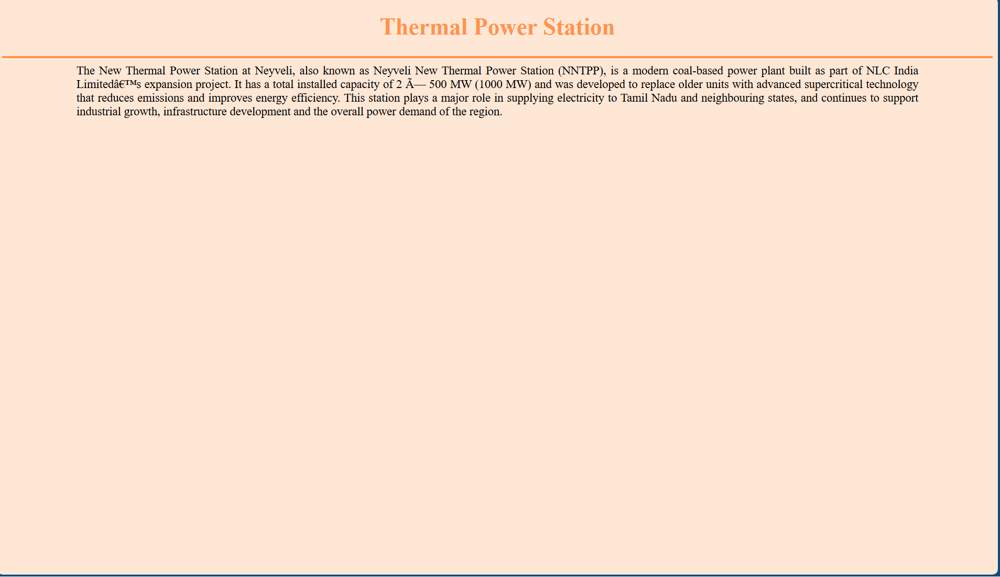
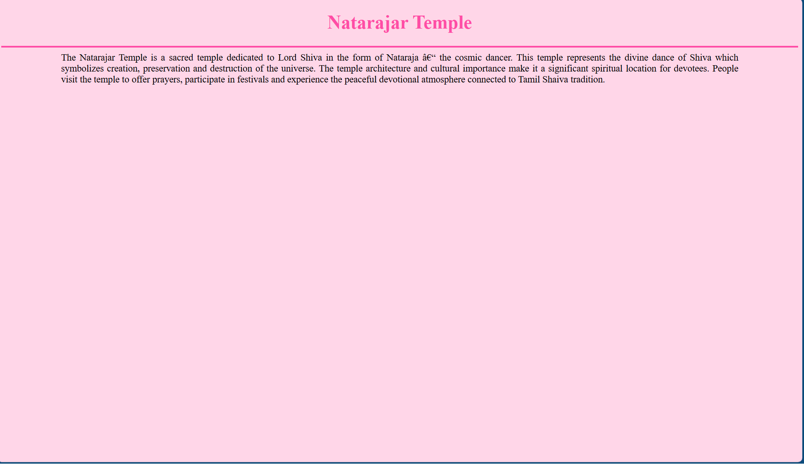
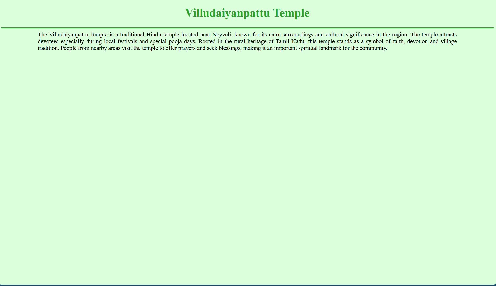
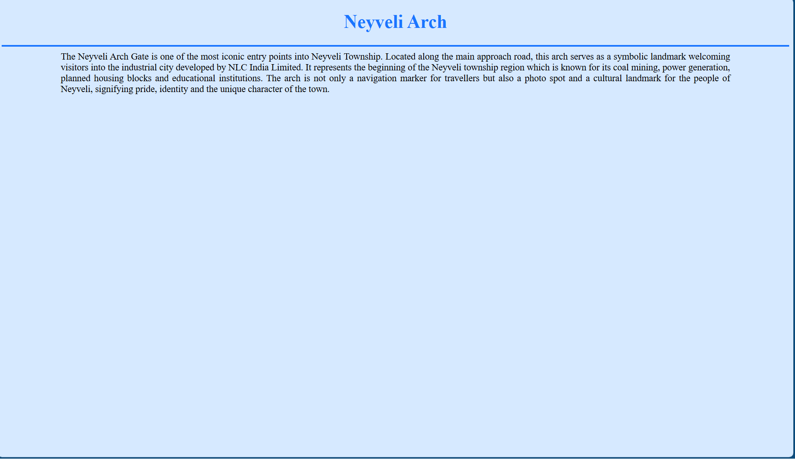

# Ex04 Places Around Me
## Date: 02-11-25

## AIM
To develop a website to display details about the places around my house.

## DESIGN STEPS

### STEP 1
Create a Django admin interface.

### STEP 2
Download your city map from Google.

### STEP 3
Using ```<map>``` tag name the map.

### STEP 4
Create clickable regions in the image using ```<area>``` tag.

### STEP 5
Write HTML programs for all the regions identified.

### STEP 6
Execute the programs and publish them.

## CODE
map.html
```
<!DOCTYPE html>
<html>
<head>
    <meta charset="utf-8">
    <title>My City</title>
</head>
<body>

    <center>
        <font color="#5A00BF"><h2><b>Neyveli T.S</b></h2></font>
        <font color="#005A66"><h3><b>Devashri S (212224040063)</b></h3></font>
    </center>

    <center>
        
        <map name="MyCity">
            <area shape="rect" coords="853,268,1011,394" href="natarajar.html" title="Natarajar Temple">
            <area shape="rect" coords="884,346,1041,472" href="Villudaiyanpattu.html" title="Villudaiyanpattu Temple">
            <area shape="rect" coords="1295,42,1452,168" href="arch.html" title="Neyveli Arch Gate">
            <area shape="rect" coords="152,194,310,320" href="jawahar.html" title="Jawahar Science College">
            <area shape="rect" coords="90,470,250,600" href="thermal.html" title="New Thermal Power Station">
        </map>
    </center>

</body>
</html>
```
natarajar.html
```
<!DOCTYPE html>
<html>
<head>
<title>Neyveli T.S</title>
</head>
<body style="background-color:#ffd6e8; color:black; font-size:18px;">

<h1 align="center" style="color:#ff4da6;">Natarajar Temple</h1>

<hr style="height:3px; background-color:#ff4da6; border:none; width:100%;">

<p style="width:85%; margin:auto; text-align:justify;">
    The Natarajar Temple is a sacred temple dedicated to Lord Shiva in the form of Nataraja – the cosmic dancer. This temple represents the divine dance of Shiva which symbolizes creation, preservation and destruction of the universe. The temple architecture and cultural importance make it a significant spiritual location for devotees. People visit the temple to offer prayers, participate in festivals and experience the peaceful devotional atmosphere connected to Tamil Shaiva tradition.
</p>

</body>
</html>
```
villudaiyan.html
```
<!DOCTYPE html>
<html>
<head>
<title>Neyveli T.S</title>
</head>
<body style="background-color:#dbffda; color:black; font-size:18px;">

<h1 align="center" style="color:#29a329;">Villudaiyanpattu Temple</h1>

<hr style="height:3px; background-color:#29a329; border:none; width:100%;">

<p style="width:85%; margin:auto; text-align:justify;">
    The Villudaiyanpattu Temple is a traditional Hindu temple located near Neyveli, known for its calm surroundings and cultural significance in the region. The temple attracts devotees especially during local festivals and special pooja days. Rooted in the rural heritage of Tamil Nadu, this temple stands as a symbol of faith, devotion and village tradition. People from nearby areas visit the temple to offer prayers and seek blessings, making it an important spiritual landmark for the community.
</p>

</body>
</html>
```
thermal.html
```
<!DOCTYPE html>
<html>
<head>
<title>Neyveli T.S</title>
</head>
<body style="background-color:#ffe7d6; color:black; font-size:18px;">

<h1 align="center" style="color:#ff944d;">Thermal Power Station</h1>

<hr style="height:3px; background-color:#ff944d; border:none; width:100%;">

<p style="width:85%; margin:auto; text-align:justify;">
    The New Thermal Power Station at Neyveli, also known as Neyveli New Thermal Power Station (NNTPP), is a modern coal-based power plant built as part of NLC India Limited’s expansion project. It has a total installed capacity of 2 × 500 MW (1000 MW) and was developed to replace older units with advanced supercritical technology that reduces emissions and improves energy efficiency. This station plays a major role in supplying electricity to Tamil Nadu and neighbouring states, and continues to support industrial growth, infrastructure development and the overall power demand of the region.
</p>

</body>
</html>

```
arch.html
```
<!DOCTYPE html>
<html>
<head>
<title>Neyveli T.S</title>
</head>
<body style="background-color:#d6e9ff; color:black; font-size:18px;">

<h1 align="center" style="color:#1a75ff;">Neyveli Arch</h1>

<hr style="height:3px; background-color:#1a75ff; border:none; width:100%;">

<p style="width:85%; margin:auto; text-align:justify;">
    The Neyveli Arch Gate is one of the most iconic entry points into Neyveli Township. Located along the main approach road, this arch serves as a symbolic landmark welcoming visitors into the industrial city developed by NLC India Limited. It represents the beginning of the Neyveli township region which is known for its coal mining, power generation, planned housing blocks and educational institutions. The arch is not only a navigation marker for travellers but also a photo spot and a cultural landmark for the people of Neyveli, signifying pride, identity and the unique character of the town.
</p>

</body>
</html>
```
jawahar.html
```
<!DOCTYPE html>
<html>
<head>
<title>Neyveli T.S</title>
</head>
<body style="background-color:#e8e2ff; color:black; font-size:18px;">

<h1 align="center" style="color:#7d4dff;">Jawahar Science College</h1>

<hr style="height:3px; background-color:#7d4dff; border:none; width:100%;">

<p style="width:85%; margin:auto; text-align:justify;">
    Established in 1987, Jawahar Science College is a co-educational institution situated in Block 14, Neyveli T.S., Tamil Nadu. It is managed by the Jawahar Education Society and offers a wide range of undergraduate and postgraduate courses in sciences, commerce, business and humanities. With a sprawling campus and well-equipped infrastructure including labs, library, computer centre and placement cell, the college is dedicated to fostering academic excellence, innovation and holistic student development.
</p>

</body>
</html>
```

## OUTPUT








## RESULT
The program for implementing image maps using HTML is executed successfully.
